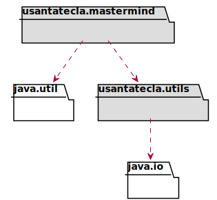
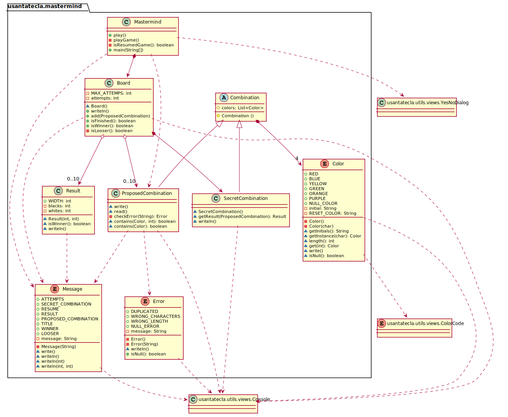
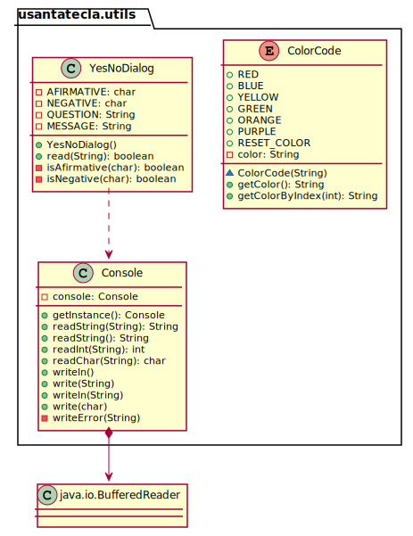
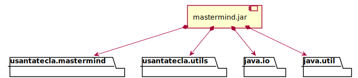
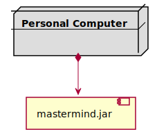

# Master Mind. Solución 1.1. *domainModel*
Santa Tecla  
[parqueNaturalSantaTecla@gmail.com ](mailto:parqueNaturalSantaTecla@gmail.com )  
version 0.0.1  

**Índice**
1. [Requisitos 1. Básica](#requisitos-1-básica)
2. [Vista de Lógica/Diseño](#vista-de-lógicadiseño)  
    2.1. [Arquitectura](#arquitectura)      
    2.2. [Paquete mastermind](#paquete-mastermind)  
    2.3. [Paquete utils](#paquete-utils)  
3. [Calidad del Software](#calidad-del-software)  
    3.1. [Diseño](#diseño)  
    3.2. [Rediseño](#rediseño) 
4. [Vista de Desarrollo/Implementación](#vista-de-desarrolloimplementación)
5. [Vista de Despliegue/Física](#vista-de-desplieguefísica)
6. [Vista de Procesos](#vista-de-procesos)

## Requisitos 1. *Básica*

| [Youtube](https://www.youtube.com/watch?v=2-hTeg2M6GQ)   * _Funcionalidad: **Básica**_   * _Interfaz: **Texto**_   * _Distribución: **Stand Alone**_   * _Persistencia: **No**_  |  | 
| :------- | :------: |

## Vista de Lógica/Diseño

- Aplicación del *Modelo del Dominio* mediante Estrategias de *Análisis Formal*, *Análisis Clásico*, *Experto del Dominio*, *Reparto de Responsabilidades*, ...

### Arquitectura

### Paquete *mastermind*

### Paquete *utils*

## Calidad del Software
### Diseño
- **Método largo**: Método *play* de Mastermind,...
### Rediseño

- _Nueva interfaz: Gráfica_
    * **Clases Grandes**: los Modelos asumen la responsabilidad y crecen en líneas, métodos, atributos, ... con cada nueva tecnología_#
    * **Alto acoplamiento**: los Modelos con cada nueva tecnología de interfaz (consola, gráficos, web, ...)_#
    * **Baja cohesión**: cada Modelo está gestionando sus atributos y las tecnologías de interfaz_#
    * **Open/Close**: hay que modificar los modelos que estaban funcionando previamente para escoger una tecnología de vista u otra (if's anidados)_#

- _Nuevas funcionalidades: undo/redo, demo, estadísiticas,..._
    * **Clases Grandes**: los Modelos asumen la responsabilidad y crecen en líneas, métodos, atributos, ... con las nuevas funcionalidades_#
    * **Open/Close**: hay que modificar los modelos que estaban funcionando previamente para incorporar nuevas funcionalidades_#

## Vista de Desarrollo/Implementación

## Vista de Despliegue/Física

## Vista de Procesos

- No hay concurrencia