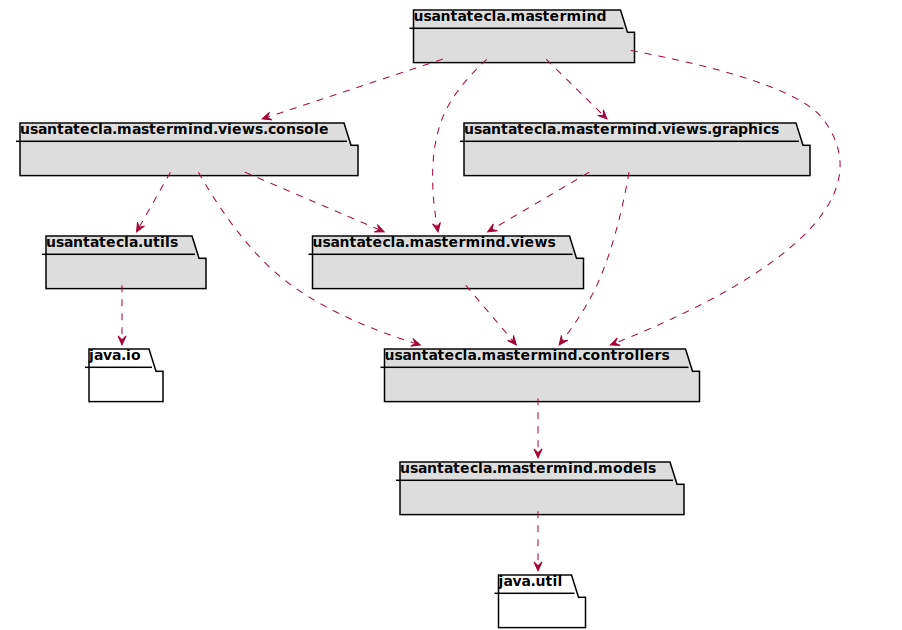
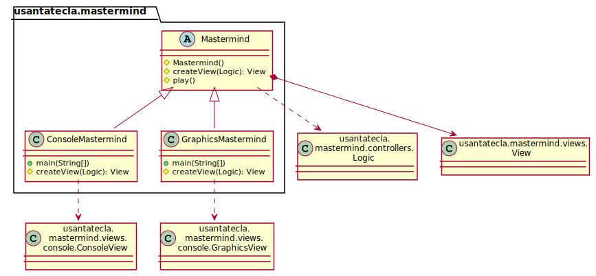
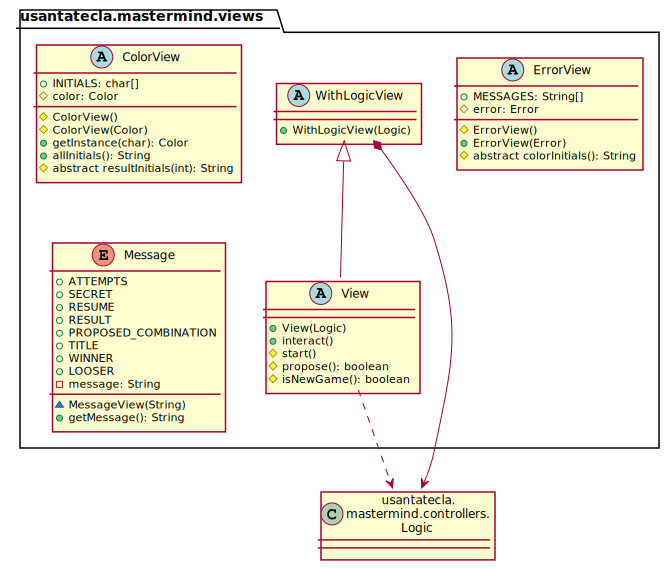
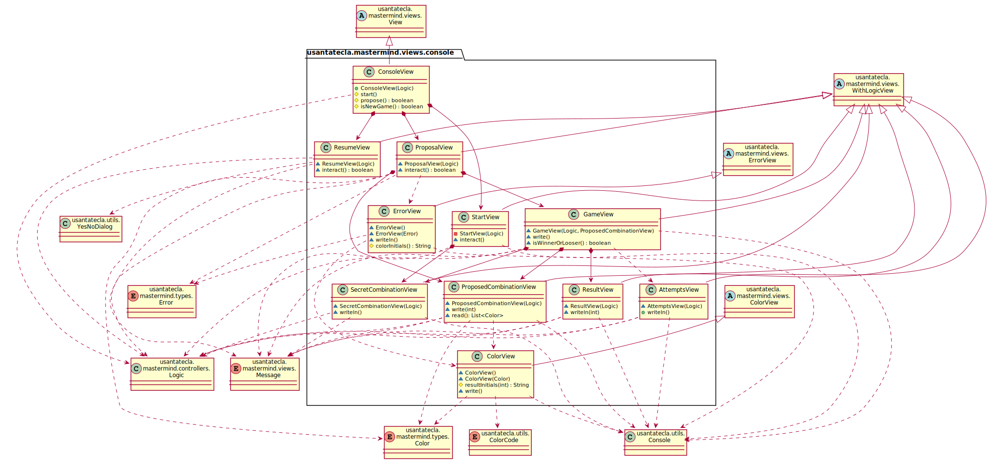
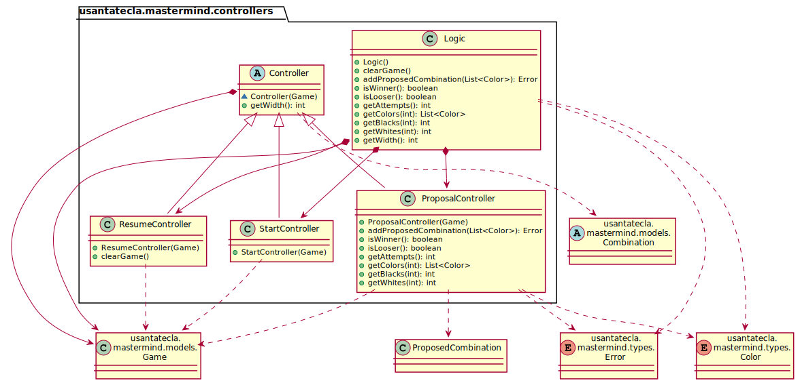
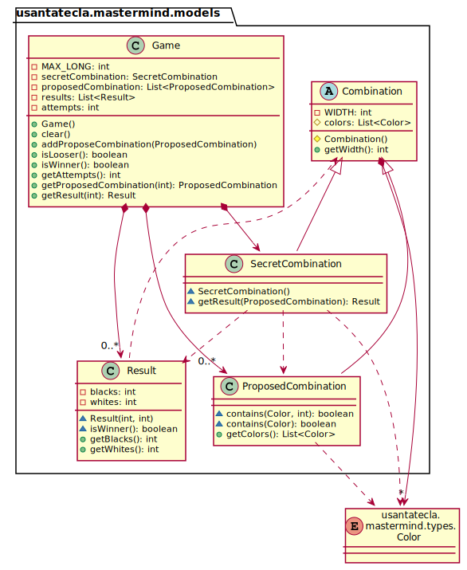
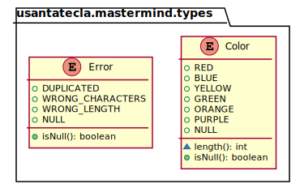
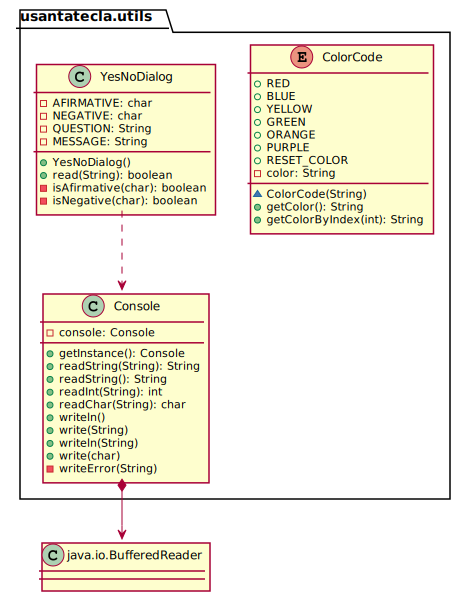
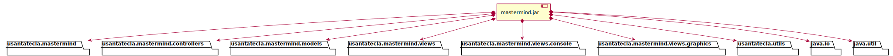
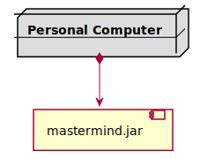

# Mastermind. Solución 6.2. *mvp.pm.+facade*
Santa Tecla  
[parqueNaturalSantaTecla@gmail.com ](mailto:parqueNaturalSantaTecla@gmail.com )  
version 0.0.1  

**Índice**
1. [Requisitos 2. Gráficos](#requisitos-2-graficos)  
2. [Vista de Lógica/Diseño](#vista-de-lógicadiseño)  
    2.1. [Arquitectura](#arquitectura)  
    2.2. [Paquete mastermind](#paquete-mastermind)  
    2.3. [Paquete mastermind.views](#paquete-mastermind-viewa)  
    2.4. [Paquete mastermind.views.console](#paquete-mastermind-views-console)  
    2.5. [Paquete mastermind.controllers](#paquete-mastermind-controllers)  
    2.6. [Paquete mastermind.models](#paquete-mastermind-models)  
    2.7. [Paquete mastermind.types](#paquete-mastermind-types)  
    2.8. [Paquete mastermind.utils](#paquete-mastermind-utils)  
3. [Calidad del Software](#calidad-del-software)  
    3.1. [Diseño](#diseño)  
    3.2. [Rediseño](#rediseño) 
4. [Vista de Desarrollo/Implementación](#vista-de-desarrolloimplementación)
5. [Vista de Despliegue/Física](#vista-de-desplieguefísica)
6. [Vista de Procesos](#vista-de-procesos)

## Requisitos 2. *Gráficos*

| [Youtube](https://www.youtube.com/watch?v=2-hTeg2M6GQ)   * _Funcionalidad: **Básica**_   * _Interfaz: **Gráfica** y **Texto**_   * _Distribución: **Stand Alone**_   * _Persistencia: **No**_  |  | 
| :------- | :------: |

## Vista de Lógica/Diseño

- Modelo/Vista/Presentador con Presentador del Modelo
    * **Patrón Facade**, para la lógica del conjunto de Controladores y Modelos

### Arquitectura

### Paquete *mastermind*

### Paquete *mastermind.views*

### Paquete *mastermind.views.console*

### Paquete *mastermind.controllers*

### Paquete *mastermind.models*

### Paquete *mastermind.types*

### Paquete *utils*

## Calidad del Software
### Diseño
- **DRY:**: en las clases de vistas que asume el flujo de control y se repite en mastermind.views.console.ProposalView y mastermind.views.graphics.GameView
### Rediseño
- Nuevas funcionalidades: undo/redo, demo, estadísiticas,…
    * **Alto Acoplamiento:** los Vistas reciben los nuevos controladores por constructor

## Vista de Desarrollo/Implementación

## Vista de Despliegue/Física

## Vista de Procesos

- No hay concurrencia