# Mastermind. Solución 10.4. *mvp.pm.-proxy*
Santa Tecla  
[uSantaTecla@gmail.com ](mailto:uSantaTecla@gmail.com )  

**Índice**
1. [Requisitos 4. Cliente/Servidor](#requisitos-4-clienteservidor)
2. [Vista de Lógica/Diseño](#vista-de-lógicadiseño)  
   2.1. [Arquitectura](#arquitectura)  
   2.2. [Paquete mastermind](#paquete-mastermind)  
   2.3. [Paquete mastermind.views](#paquete-mastermindviews)  
   2.4. [Paquete mastermind.controllers](#paquete-mastermindcontrollers)  
   2.5. [Paquete mastermind.models](#paquete-mastermindmodels)  
   2.6. [Paquete mastermind.types](#paquete-mastermindtypes)  
   2.7. [Paquete mastermind.distributed](#paquete-masterminddistributed)  
   2.8. [Paquete mastermind.distributed.dispatchers](#paquete-masterminddistributeddispatchers)  
   2.9. [Paquete mastermind.utils](#paquete-utils)
3. [Calidad del Software](#calidad-del-software)  
   3.1. [Diseño](#diseño)  
   3.2. [Rediseño](#rediseño)  
4. [Vista de Desarrollo/Implementación](#vista-de-desarrolloimplementación)
5. [Vista de Despliegue/Física](#vista-de-desplieguefísica)
6. [Vista de Procesos](#vista-de-procesos)

## Requisitos 4. *Cliente/Servidor*

| [Youtube](https://www.youtube.com/watch?v=2-hTeg2M6GQ)   * _Funcionalidad: **Básica +undo/redo**_   * _Interfaz: **Gráfica** y **Texto**_   * _Distribución: **Stand Alone + Client/Server**_   * _Persistencia: **No**_  |  | 
| :------- | :------: |

## Vista de Lógica/Diseño

- Modelo/Vista/Presentador con Presentador del Modelo con **Vista Achicda**

### Arquitectura
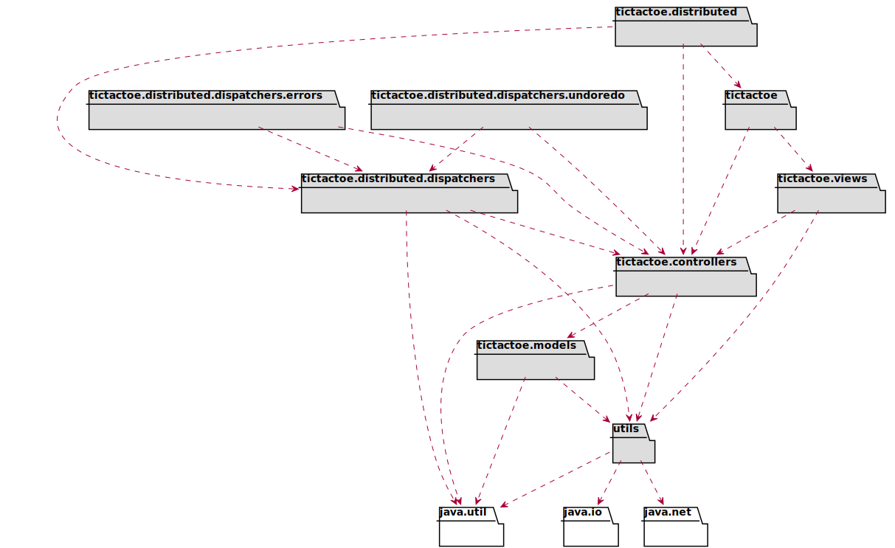

### Paquete *mastermind*
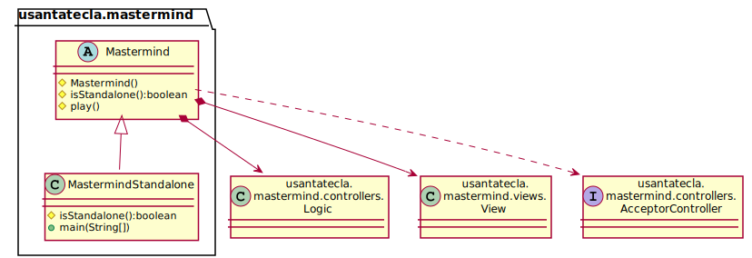

### Paquete *mastermind.views*
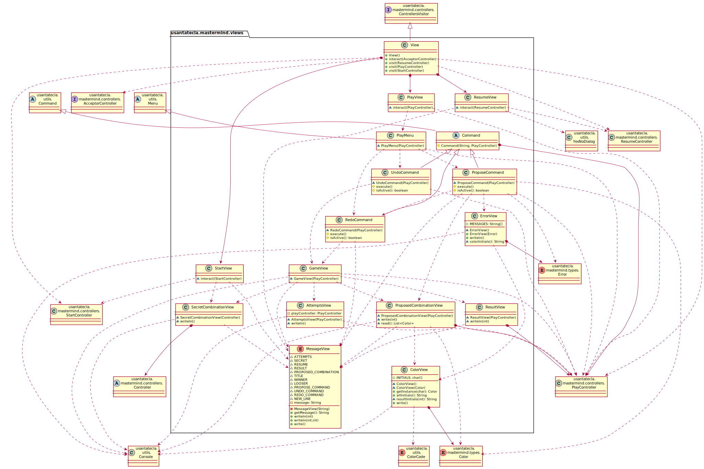

### Paquete *mastermind.controllers*
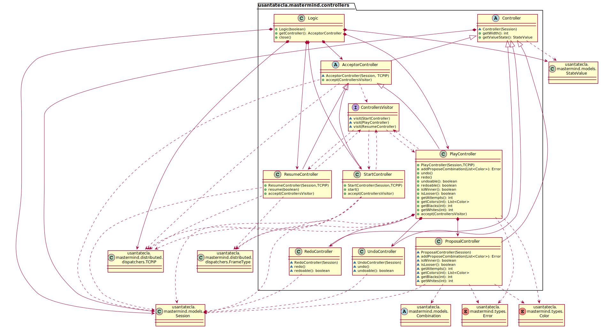

### Paquete *mastermind.models*
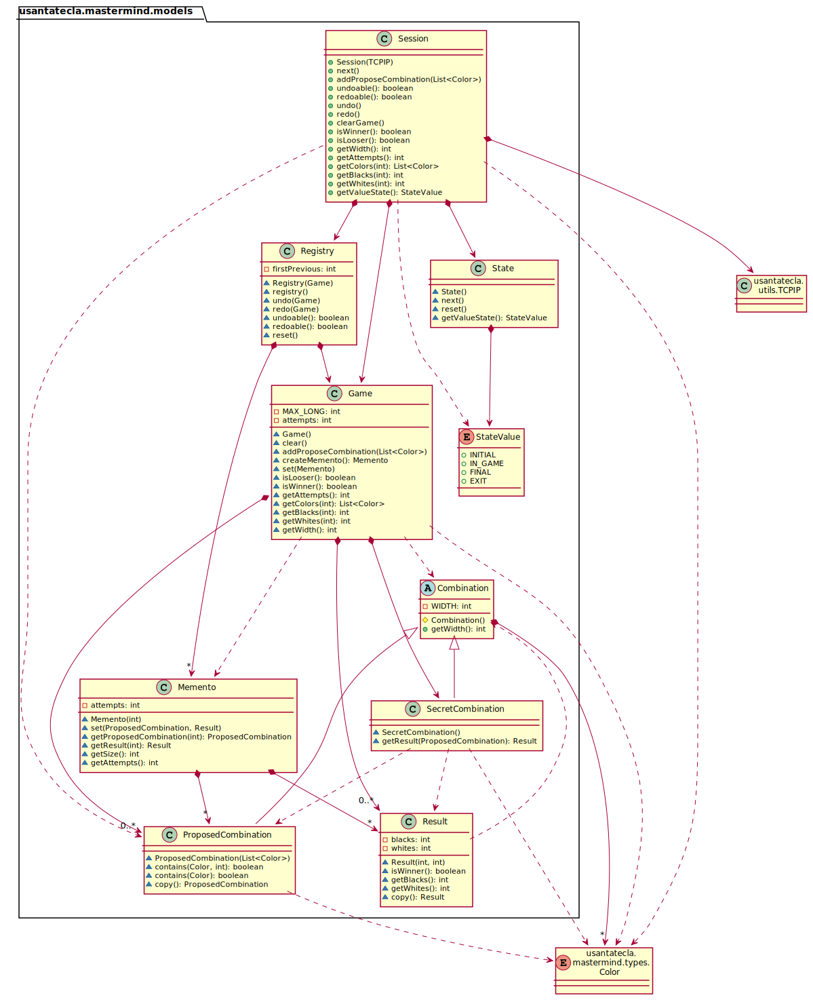

### Paquete *mastermind.types*
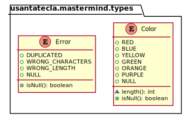

### Paquete *mastermind.distributed*
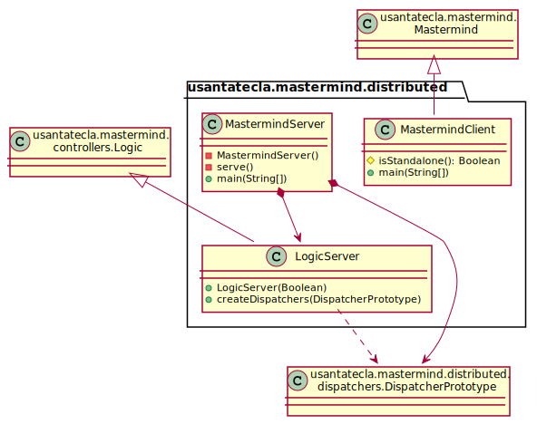

### Paquete *mastermind.distributed.dispatchers*
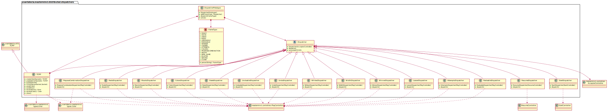

### Paquete *utils*
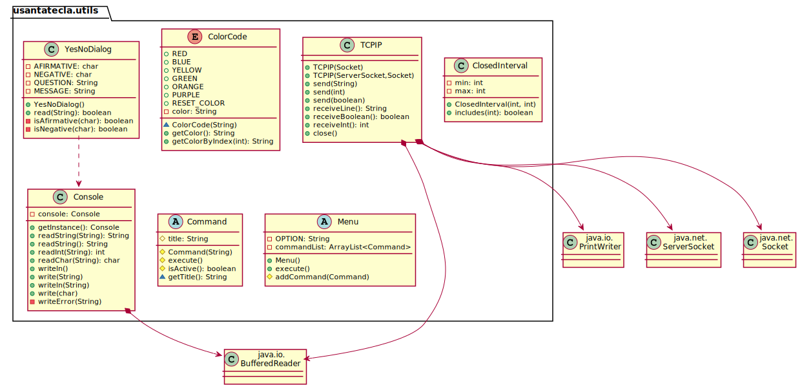

## Calidad del Software
### Diseño  
- **Baja Cohesión**: *de Lógica y Controladores que controlan y comunican.*
- **Alto Acoplamiento**: *de Lógica y Controladores a tecnologías de comunicación.*
- **Open/Close**: *en Lógica y Controladores cuando hay que cambiar el código de éstos con nuevas tecnologías de comunicación.*  
  
### Rediseño
- **Clases Grandes**: *de Controladores con distintas ramas para distintas tecnologías de comunicación.*

## Vista de Desarrollo/Implementación
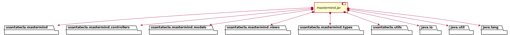  

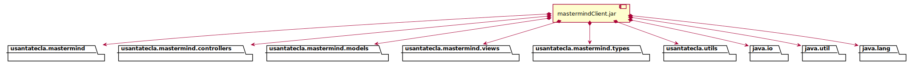  

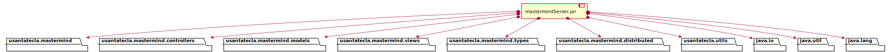

## Vista de Despliegue/Física
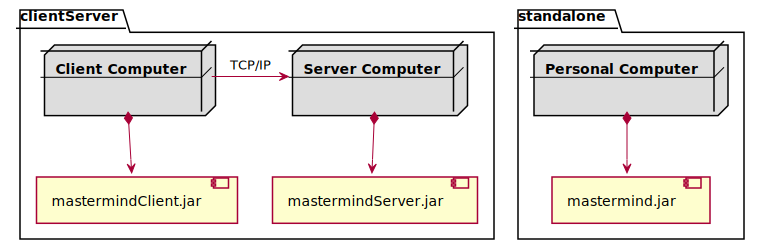

## Vista de Procesos

- No hay concurrencia
